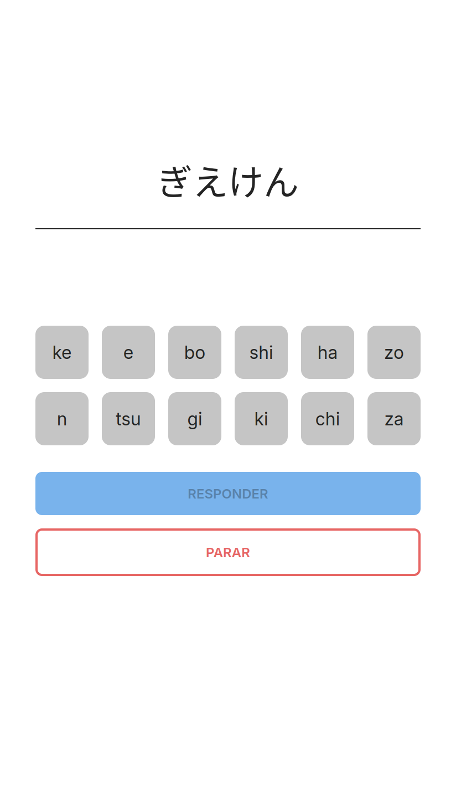
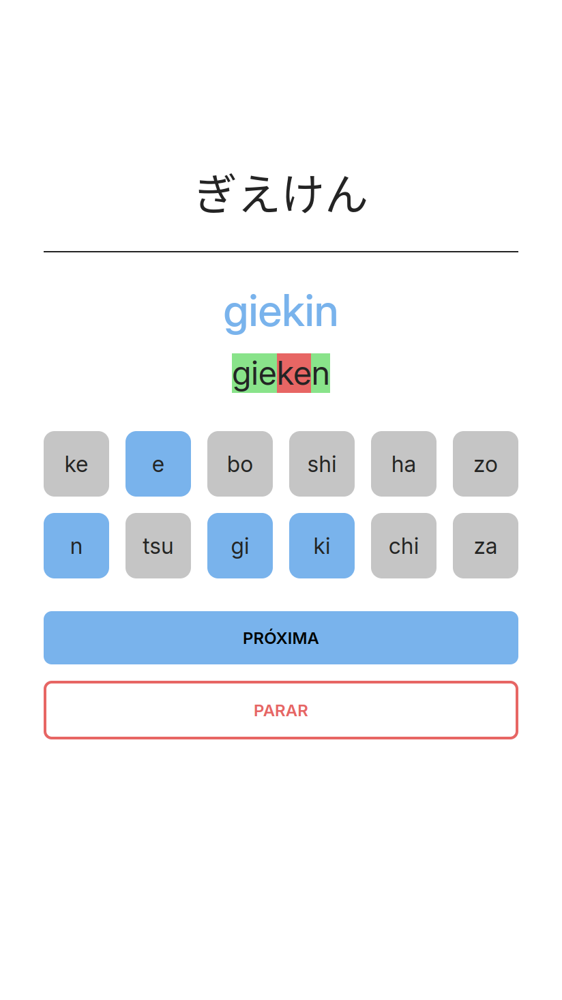
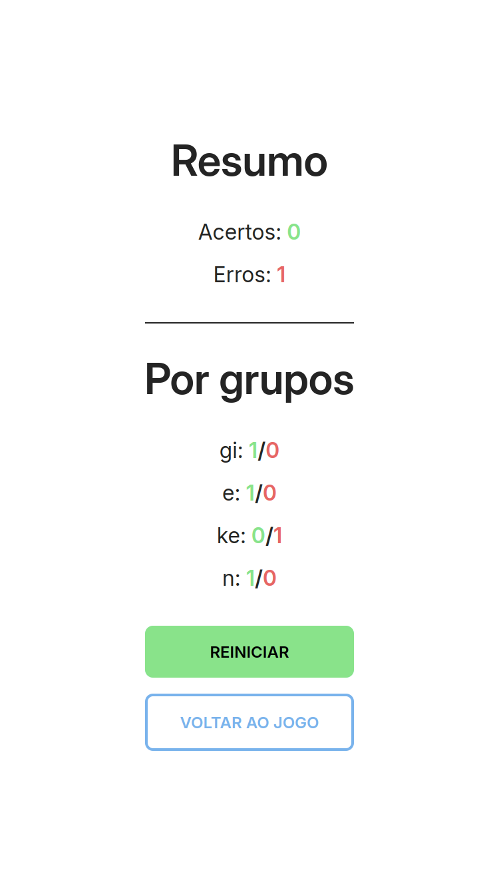

# Katakest

Katakest is an application that assists in memorizing Japanese characters, specifically Hiragana and Katakana. It provides a basic, interactive way to practice recognizing and recalling the characters.

# Motivation

Learning Japanese characters can be challenging, especially for beginners. Katakest aims to make the process more engaging and effective by providing a simple, interactive tool for practice. By offering immediate feedback and progress tracking, users can focus on kanas that need more practice and gradually improve their memorization skills.

I started this project as an excuse to practice TypeScript and explore some of the latest technologies in its ecosystem. Since I work as a Java developer, I want to keep my skills sharp in more flexible languages. Plus, it's a fun way to dust off my GitHub 🕸️🕸️.

## Features

- Random selection of characters for practice.
- Immediate feedback on answers.
- Progress tracking.
- User-friendly interface.

## Technologies

- [Solid.js](https://solidjs.com/): A declarative JavaScript library for building user interfaces.
- [Vite](https://vitejs.dev/): A fast build tool that provides instant server start and hot module replacement.
- [TypeScript](https://www.typescriptlang.org/): A statically typed superset of JavaScript that compiles to plain JavaScript.
- [pnpm](https://pnpm.io/): A fast, disk-space-efficient package manager.

## Screenshots

### Main Screen



### Practice Session



### Results Screen



## Installation and Usage

To install the dependencies, run:

```bash
npm install
# or
pnpm install
# or
yarn install
```

To start the development server, run:

```bash
npm dev
# or
pnpm dev
# or
yarn dev
```

We recommend using [pnpm](https://pnpm.io/) for managing dependencies, as the lockfile is already included in the repository.

## Directory Structure

- **.vscode/**: Contains Visual Studio Code specific settings.

- **docs/**: Documentation related files.

- **public/**: Static files that are served directly by the web server.

- **src/**: Source code of the application.

  - **assets/**: Static assets like images, fonts, etc., used in the application.
  - **components/**: Solid.js components used in the application.
  - **context/**: Context providers for managing global state.
  - **domain/**: Domain-specific entities and data structures.
  - **infra/**: Infrastructure-related code, such as hooks and utilities for interacting with external systems.
  - **logic/**: Business logic and core functionality of the application.
  - **utils/**: Utility functions and helpers used throughout the application.

- **.gitignore**: Specifies files and directories that should be ignored by Git.

- **index.html**: The main HTML file for the application.

- **LICENSE**: License file for the project.

- **package.json**: Contains metadata about the project and its dependencies.

- **pnpm-lock.yaml**: Lockfile for pnpm to ensure consistent installs.

- **README.md**: Documentation file for the project.

- **tsconfig.app.json**: TypeScript configuration specific to the application.

- **tsconfig.json**: Base TypeScript configuration file.

- **tsconfig.node.json**: TypeScript configuration for building and running the application.

- **vite.config.ts**: Configuration file for Vite, the build tool used in the project.

## Code Structure

The main components of the application are:

- [`MainScreen`](./src/components/MainScreen.tsx): The main screen where users can start practice sessions.
- [`ResultsScreen`](./src/components/ResultsScreen.tsx): The screen that displays the results of the practice sessions.
- [`GameContext`](./src/context/GameContext.tsx): The context that provides the game state and logic to the components.

```tsx
import { render } from "solid-js/web";
import { Router, Route } from "@solidjs/router";
import "./index.css";
import MainScreen from "@components/MainScreen";
import ResultsScreen from "@components/ResultsScreen";
import { GameProvider } from "@context/GameContext";

const root = document.getElementById("root");

function App() {
  return (
    <GameProvider>
      <Router>
        <Route path="/" component={MainScreen} />
        <Route path="/results" component={ResultsScreen} />
      </Router>
    </GameProvider>
  );
}

render(() => <App />, root!);
```
